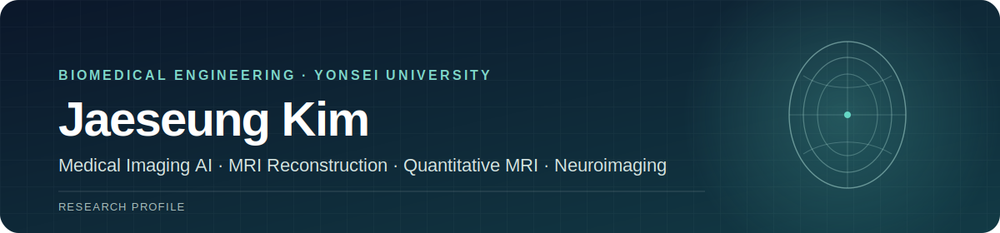

  

  Biomedical engineering researcher working at the intersection of <strong>MRI physics</strong>, <strong>medical imaging AI</strong>, and <strong>quantitative neuroimaging</strong>.

  
  
  

---

## Profile

| | |
|---|---|
| **Affiliation** | Advanced Image Processing Techniques Lab, Yonsei University |
| **Education** | B.S. candidate in Biomedical Engineering; second major in Electrical & Electronic Engineering |
| **Academic standing** | **Department rank 1 / 49** *(as of 2026-07-01)* · GPA **4.03 / 4.30** |
| **Recognition** | Best Paper Award, KOSOMBE Fall Conference 2025 · National Science & Engineering Scholarship |

## Research Focus

| Area | Current interests |
|---|---|
| **MRI reconstruction & image formation** | Reconstruction algorithms, acquisition-aware modeling, and frequency-domain analysis |
| **Quantitative MRI** | Quantitative parameter estimation, image synthesis, and preservation of tissue-sensitive information |
| **Medical image learning** | 3D image-to-image learning, harmonization, domain generalization, and uncertainty-aware evaluation |
| **Neuroimaging inference** | Voxel-wise statistical analysis and validation of downstream scientific conclusions |
| **Efficient deep learning** | Model compression, knowledge distillation, and dynamic inference for constrained deployment |

## Research Status

> Current research projects, code, and reproducibility materials remain private while manuscripts and intellectual-property considerations are in progress. Public releases will follow publication or formal disclosure approval.

## Contact

For research discussions or collaboration inquiries: **[xmflak20@gmail.com](mailto:xmflak20@gmail.com)**
